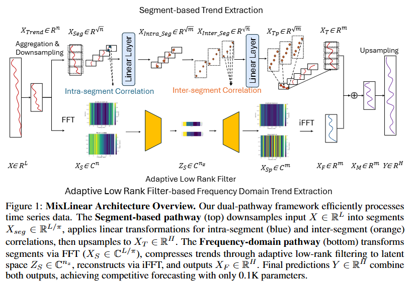
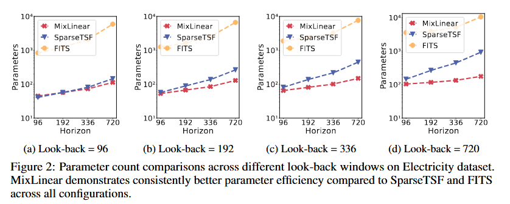
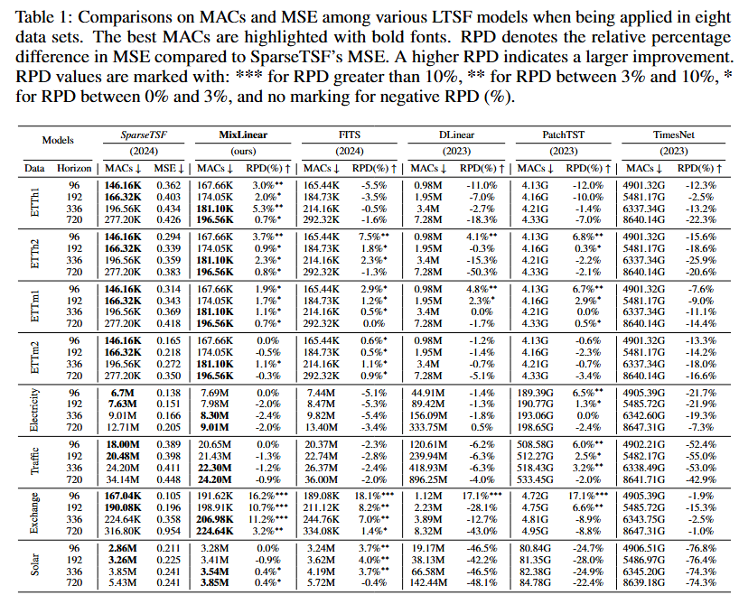
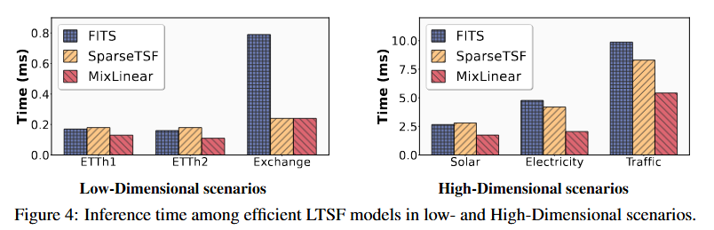

# 🚀 MixLinear

[](https://iclr.cc/)
[](https://pytorch.org/)
[](#)
[](#)

Welcome to the official repository of **MixLinear**, the ICLR 2026 paper:

> **MixLinear: Extreme Low-Resource Multivariate Time Series Forecasting with 0.1K Parameters**  
> *Aitian Ma, Dongsheng Luo, Mo Sha*  
> <sup>1</sup>Knight Foundation School of Computing and Information Sciences, Florida International University


[📄 Paper](https://arxiv.org/abs/2410.02081) • 
[🎥 Presentation & Slides](https://recorder-v3.slideslive.com/#/share?share=108680&s=4eeab25b-f387-4749-88fd-562b4baea0e9) •
[👤 Profile](https://aitianma.github.io/) • 
[🎓 Google Scholar](https://scholar.google.com/citations?user=fsVMRlsAAAAJ)


🎉 *Published as a conference paper at **ICLR 2026***

---

## 🔥 TL;DR

**MixLinear** is a dual-domain forecasting model that achieves state-of-the-art long-term time series forecasting performance using just **0.1K parameters** — up to **98% fewer parameters** and **3.2× faster inference** than existing efficient baselines.

By processing local trends in the time domain and global trends in the frequency domain, MixLinear reduces model complexity from **O(n²)** to **O(n)** while preserving accuracy, enabling deployment on edge devices, embedded systems, and low-resource environments.

---

## ✨ Why MixLinear?

| Feature | MixLinear |
|----------|------------|
| Parameters | ~0.1K |
| Time Complexity | O(n log n) |
| Space Complexity | O(n) |
| Architecture | Time + Frequency Dual Pathway |
| Target Scenarios | Edge / IoT / Small Data / Real-Time |

🏆 Up to 16.2% MSE improvement over SparseTSF  
⚡ Up to 3.2× faster inference  
📦 81–98% parameter reduction vs. lightweight baselines  
🌍 Strong cross-domain generalization  

---

## 🧠 Core Idea

MixLinear is motivated by a key observation about time series structure:

> Local trends are best modeled in the time domain, while global trends are sparse in the frequency domain.

Instead of forcing a single architecture to model both, MixLinear introduces a dual-domain framework:

### 🔹 Segment-Based Trend Extraction (Time Domain)

Local temporal patterns are captured using factorized linear transformations that disentangle:

- Intra-segment correlations (local shape, slopes)
- Inter-segment correlations (long-range drift)

This reduces dense forecasting layers from **O(n²)** parameters to **O(n)**.

### 🔹 Adaptive Low-Rank Spectral Filtering (Frequency Domain)

Global trends are processed via learnable rank-constrained complex filters, compressing spectral representations into an ultra-low-dimensional latent space while preserving dominant frequency modes.

### 🔹 Unified Forecasting

Final prediction combines both pathways:

```
Y = F_segment(X) + F_frequency(X)
```

This additive fusion preserves domain-specific representations while enabling joint optimization, achieving an unprecedented efficiency–accuracy tradeoff.

---

## 🏗️ Architecture Overview




---

## 📊 Results

### Parameter Efficiency



MixLinear maintains near-linear parameter growth and uses as few as **45–176 parameters**, compared to **1K+** for SparseTSF and **10K+** for FITS.

---

### Accuracy vs Efficiency



MixLinear achieves competitive or superior forecasting accuracy across eight benchmarks while using orders of magnitude fewer parameters.

---

### Runtime Performance



MixLinear delivers:

- Up to 3.2× speedup in low-dimensional datasets  
- Up to 2.6× speedup in high-dimensional datasets  

---

## ⚡ Getting Started

### Environment Setup

```bash
conda create -n MixLinear python=3.8
conda activate MixLinear
pip install -r requirements.txt
```

---

### Data Preparation

Download datasets from Autoformer:

https://drive.google.com/drive/folders/1ZOYpTUa82_jCcxIdTmyr0LXQfvaM9vIy

Place CSV files in:

```
./dataset
```

Example:

```
./dataset/ETTh1.csv
```

---

### Training


Run single dataset:

```bash
sh scripts/MixLinear/etth1.sh
```

---

## 🧪 Using MixLinear on Your Own Data

MixLinear does not require strong periodicity assumptions and generalizes well across domains.

Recommended hyperparameters:

- `segment_len` — local granularity
- `rank` — spectral compression level (default: 2)

The model is stable across wide ranges of both.

---

## 📚 Citation

```bibtex
@inproceedings{ma2026mixlinear,
  title={MixLinear: Extreme Low-Resource Multivariate Time Series Forecasting with 0.1K Parameters},
  author={Ma, Aitian and Luo, Dongsheng and Sha, Mo},
  booktitle={International Conference on Learning Representations (ICLR)},
  year={2026}
}
```

---

## 📬 Contact

Aitian Ma — ama003@fiu.edu  
Dongsheng Luo — dluo@fiu.edu  
Mo Sha — msha@fiu.edu  

Knight Foundation School of Computing and Information Sciences  
Florida International University

---

## 🙏 Acknowledgement

We thank the following repositories for datasets and baseline implementations:

- https://github.com/lss-1138/SparseTSF 
- https://github.com/VEWOXIC/FITS  
- https://github.com/yuqinie98/patchtst  
- https://github.com/cure-lab/LTSF-Linear  
- https://github.com/zhouhaoyi/Informer2020  
- https://github.com/thuml/Autoformer  
- https://github.com/MAZiqing/FEDformer   
- https://github.com/ts-kim/RevIN  
 
